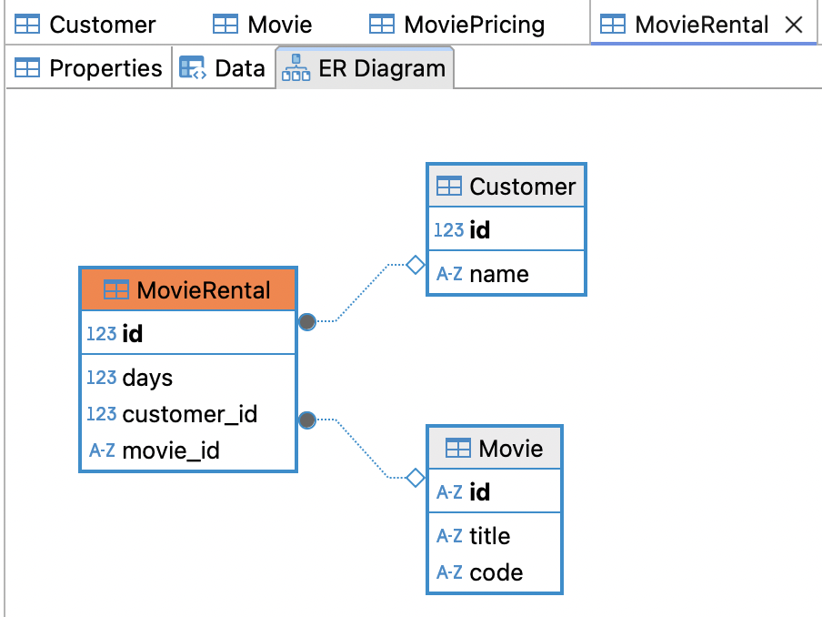

# Movie Rental Application

The application processes rental data and calculates charges and reward points for each customer. It demonstrates basic object-oriented programming principles and is structured to be easily extendable for future enhancements.

## API Reference

- http://localhost:8080/swagger-ui/index.html#/

## Features

- Calculates rental charges based on the type of movie and rental duration.
- Computes frequent renter points for each transaction.
- Generates detailed invoices using the customer's ID and name.
- Supports responses in text, JSON, and PDF formats.

## Design Decisions

- The system was planned to be implemented using Java, Builder design pattern for simplicity and later thought to use StringBuilder and String format because dynamically builds the report and gives performance and flexibility.
- Built a RESTful API to enhance scalability, modularity, and integration with modern front-end frameworks/ other services.

### ER Diagrams

## Technologies Used

- Programming Language: Java 21
- Frameworks: Spring Boot 3.5.0, JPA
- Build Tool: Gradle
- Libraries Used:
    - Used StringBuilder and String format for dynamic report generation.
    - Unit Testing: JUnit 5, Extended Mockito
    - Lombok: For reducing boilerplate code
    - Storage: H2 Database
    - Template PDF: OpenHTMLToPDF
    - Cache: Caffeine (lightweight)
    - Reactive Programming (Non-blocking): WebFlux
    - Reactive Retry Logic: Retries up to 3 times if invoice generation fails
    - API Documentation: Swagger
    - API Testing: Postman
    - Dependency Injection: Spring Framework
    - Logging: SLF4J with Logback
    - Version Control: Git

## Getting Started

To run the application:
1. Clone the repository.
2. Install dependencies (if any).
3. Run the main class `MovieRentalApplication.java` as a Spring Boot application.
4. The application will automatically create tables in the H2 database and insert sample data.
5. Import the Postman collection to test the API endpoints.

### Media Type Support
- `Accept: text/plain`
- `Accept: application/json`
- `Accept: application/pdf`

You can import the Postman collections from `main/resource/postman-collections` to test the API.

## Author
- **Name**: Suresh Ullagaddi

## Future Improvements

- **Containerization with Docker**  
  Containerize the application using Docker to ensure consistent environments across development, testing, and production.

- **Publishing to Docker Hub**  
  Publish Docker images to Docker Hub for streamlined distribution and deployment.

- **Cloud Orchestration with Kubernetes**  
  Deploy and manage the application using Kubernetes in a cloud environment to achieve scalability, high availability, and automated rollouts.

- **Event-Driven Architecture with Apache Kafka**  
  Integrate Apache Kafka to enable real-time, event-driven communication between services, enhancing responsiveness and decoupling components.

- **Artifact Management with Nexus Repository Manager**  
  Use Nexus to manage build artifacts, dependencies, and Docker images securely and efficiently.

- **Centralized Logging**  
  Integrate centralized logging to improve observability and monitoring, making it easier to track and debug issues across distributed systems.
